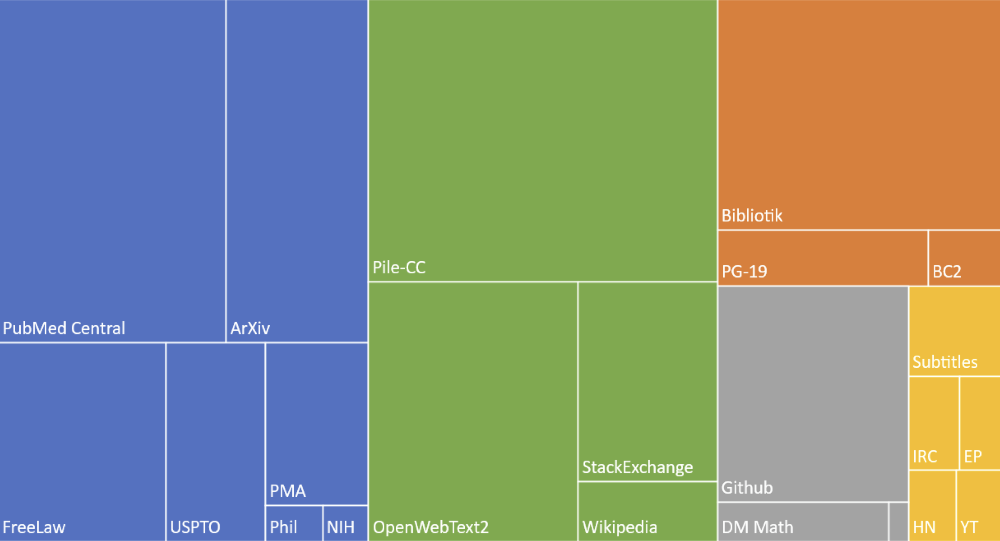

June 2nd, 2024

A recent research paper demonstrated that healthcare bias exists within a commonly-used dataset for training LLMs.

### The Pile data set

The data set they examined is called 'The Pile' and consists of 825 GB of English text from 22 data sources.

### Bias in The Pile 

The findings show that the dataset contains bias in that the disease prevalence for different demographic groups in the data does not match actual disease prevalences according to academic research and epidemiological data.

### Bias in AI models created with The Pile

They looked at the Mamba and Pythia models, which are strictly pre-trained on The Pile only.
    
They looked at the Llama2, Llama3, Mistral, and Qwen1.5 models and found the models had associations for prevalence in different languages (Chinese, English, French, and Spanish).

The methodology included a ranking method to analyzes disease subgroups based on their co-occurrences in The Pile as well as the “gold" data set derived from real-world data. This empirical method bypasses model outputs, directly measuring disease representation across different demographic contexts.  As part of the comparison, they used the Infini-gram public API for examining n-grams of any length.

The study points to the urgent need for better healthcare data, with actual disease prevalences, to be incorporated into commonly used training data sets.

	"Efforts will be made to create and employ datasets that furnish more accurate and exhaustive real-world prevalence data for diseases, especially those poorly represented in existing datasets."

Read the paper:  
Cross-Care: Assessing the Healthcare Implications of Pre-training Data on Language Model Bias
https://arxiv.org/pdf/2405.05506 [https://arxiv.org/pdf/2405.05506]